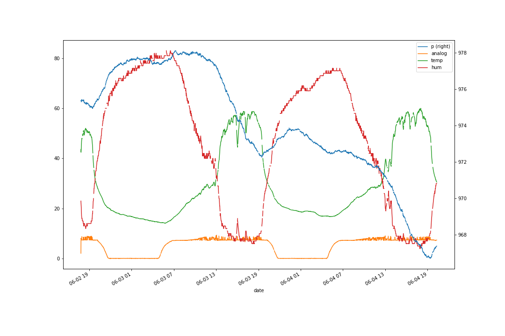

# solar-esp

Wemos Based Solar Powered ESP8266 to geather environmental data

## Arduino Code

Within the Arduino Code the sensor data are published to MQTT

## MQTT to Database

on the server, the python script subscribes to MQTT and feeds the data to a mariadb table.

## Database to Visualization

Data is read from mariadb and visualized with matplotlib

example: 

### Credits

This project was inspired by the Solar Powered WiFi Weather Station on Instructables:
http://www.instructables.com/id/Solar-Powered-WiFi-Weather-Station
